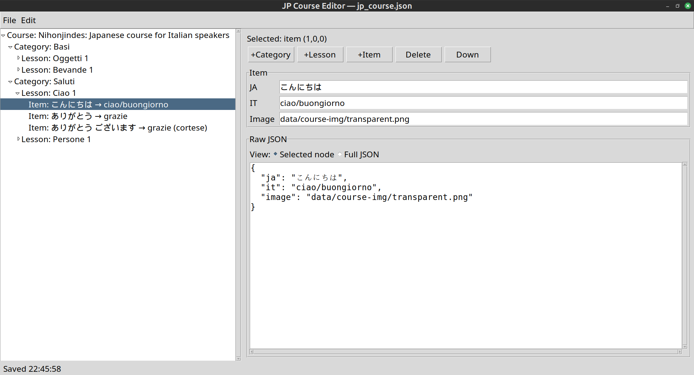
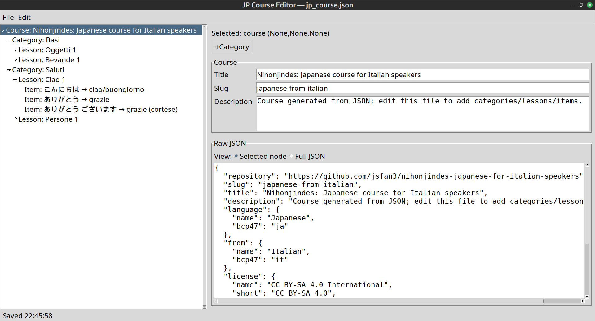

# Nihonjindes — Japanese for Italian Speakers (LibreLingo fork)

This repository is a **single-repo** setup that contains:
- the upstream **LibreLingo Community** web app (as a fork),
- a custom Japanese course for Italian speakers,
- scripts + a JSON “source of truth” used to generate all course files.

The course content (text + images) is my own work-in-progress study material.

---

## Rationale: JSON as single source of truth (while staying LibreLingo-native)

LibreLingo courses are ultimately represented as YAML (course → modules → skills).  
In this repository, I **keep course content in a single JSON specification** and *generate* the LibreLingo YAML from it.

### Why a JSON source-of-truth?
- **Reproducibility**: the course can be regenerated deterministically from one file.
- **Bulk editing**: easier to refactor categories/lessons/items than editing many YAML files by hand.
- **Consistency**: IDs, slugs, thumbnails, and image variants are produced in a uniform way.
- **Upstream compatibility**: the output is still the standard LibreLingo YAML + the standard web export format.

---

## Prerequisites

### Required
- **Node.js + npm** (to run the web app)
- **Python 3** for the generator scripts (`ll02`), plus `pip`
- `git` (and optionally `git-lfs` if your fork uses LFS assets)

### Notes about Python environments
LibreLingo’s exporter tooling (invoked by `exportYamlCourse.sh`) uses the repo’s own Python tooling under `src/`.
It may create a dedicated virtualenv under `src/.venv` automatically.

---

## First-time setup (local)

From the repo root:

1) Install Node dependencies:
```bash
npm install
```

2) Create a Python venv for the generator scripts and install requirements:
```bash
python3 -m venv .venv
./.venv/bin/pip install --upgrade pip wheel setuptools
./.venv/bin/pip install -r data/course-script/requirements.txt
```

3) Install the SvelteKit static adapter:
```bash
npm -w @librelingo/web i -D @sveltejs/adapter-static
```

---

## Pipeline overview

1) **Edit (JSON source-of-truth)**:
- GUI editor: `python3 data/course-json/jp_course_editor.py data/course-json/jp_course.json`
- Smoke test (no GUI): `python3 data/course-json/jp_course_editor.py data/course-json/jp_course.json --self-test`

2) **Images**
- The images referenced by the JSON (PNG or JPG) are placed in `data/course-img/`.
- Images should ideally be **square** and **high-resolution**.
- The generator will create 3 resized variants (for performance) under `apps/web/static/images/`.

3) **Generate YAML**:
run:
```bash
./.venv/bin/python data/course-script/ll02_generate_course_from_json.py \
    --repo . \
    --spec data/course-json/jp_course.json \
    --prune-course
```
to produce:
- `courses/japanese-from-italian/` (generated LibreLingo YAML course)
- `apps/web/static/images/` (generated image variants used by the web app)

4) **Export for the web app**:
run:
```bash
bash scripts/exportYamlCourse.sh japanese-from-italian
```
to produce:
- `apps/web/src/courses/japanese-from-italian/` (web-exported JSON `courseData.json`, challenges, introductions, etc.)

5) **Run the web app (development)**
run:
```bash
npm run web-serve
```
Then open:
- `http://localhost:5173/`

6) **Build the production static web app locally (for Apache or Nginx)**
run:
```bash
npm run -w @librelingo/web build
```
Then the static output is in:
`apps/web/build`

**Deploy:** copy the contents of `apps/web/build/` to your web server docroot (example: `/var/www/nihonjindes/`) and serve it at `/`.

Local preview:
```bash
npm run -w @librelingo/web preview
```
Then open:
- `http://localhost:4173/`

### Nginx example (SPA fallback to 200.html)

> Important: this build uses `200.html` as the SPA fallback. Make sure both the *index* and the fallback point to `200.html`.

```nginx
server {
  listen 80;
  server_name example.com;

  root /var/www/nihonjindes;
  index 200.html;

  location / {
    try_files $uri $uri/ /200.html;
  }

  # Optional: cache immutable assets aggressively
  location /_app/immutable/ {
    add_header Cache-Control "public, max-age=31536000, immutable";
    try_files $uri =404;
  }
}
```

### Apache 2.4+ example (SPA fallback to 200.html)

```apache
<VirtualHost *:80>
  ServerName example.com
  DocumentRoot /var/www/nihonjindes

  <Directory "/var/www/nihonjindes">
    Require all granted
    Options FollowSymLinks
    AllowOverride None

    # Serve 200.html at /
    DirectoryIndex 200.html

    # SPA fallback
    FallbackResource /200.html
  </Directory>
</VirtualHost>
```

If `FallbackResource` is not available/enabled on your Apache build, use a rewrite fallback instead:

```apache
<Directory "/var/www/nihonjindes">
  Require all granted
  Options FollowSymLinks
  AllowOverride None

  DirectoryIndex 200.html

  RewriteEngine On
  RewriteCond %{REQUEST_FILENAME} -f [OR]
  RewriteCond %{REQUEST_FILENAME} -d
  RewriteRule ^ - [L]
  RewriteRule ^ /200.html [L]
</Directory>
```

---

## Important note
- Do **not** edit generated YAML under `courses/japanese-from-italian/` manually.
  Always update the JSON spec and regenerate.
  Here are two screenshots of the GUI editor that I created for this course:




---

## Repository layout (important folders)

- `data/course-json/jp_course.json`  
  **Single source of truth** (“database”) for categories, lessons, items, and image paths.

- `data/course-img/`  
  Custom images referenced by the JSON.

- `data/course-script/`  
  Helper scripts:
  - `ll02_generate_course_from_json.py` → JSON → LibreLingo YAML course (and imports images)
  - (other helper scripts may be added over time)

- `courses/japanese-from-italian/`  
  Generated **LibreLingo YAML course** (do not edit by hand; regenerate from JSON).

- `apps/web/src/courses/japanese-from-italian/`  
  Generated **web-export JSON** (created by `exportYamlCourse.sh`).

---

## Opening directly into the Japanese course (recommended)

I added this file to redirect directly to the Japanese course:

`apps/web/src/routes/+page.ts`
```ts
import { redirect } from '@sveltejs/kit';
import { base } from '$app/paths';

export const load = () => {
  throw redirect(302, `${base}/course/japanese-from-italian`);
};
```

---

## Links

- Upstream: [LibreLingo Community](https://github.com/LibreLingoCommunity/LibreLingo)
- Live instance: <https://www.nihonjindes.net/>
